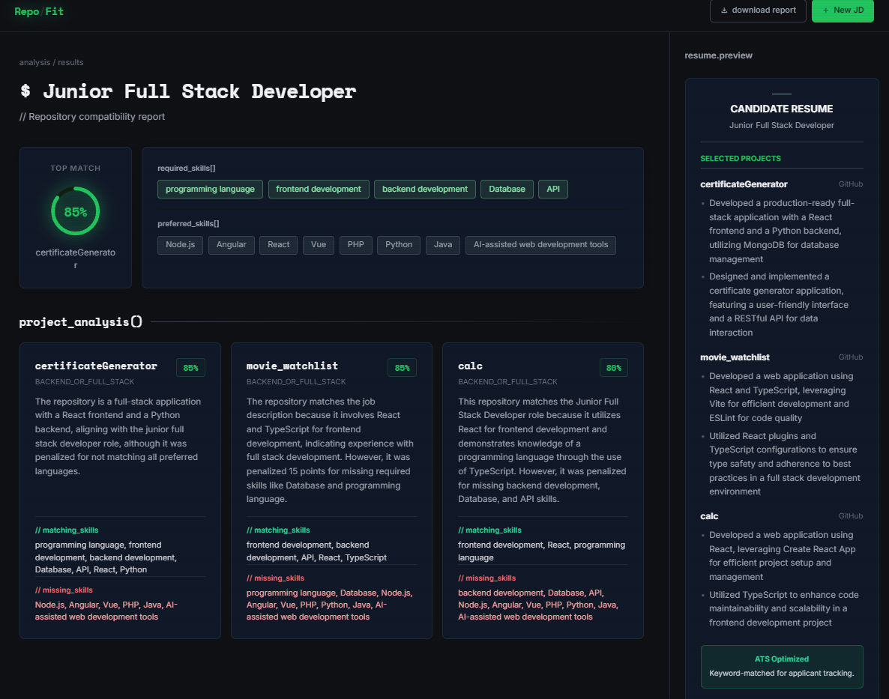

<div align="center">
  
  <h1>RepoFit</h1>
  <p><strong>Translating Code into Career Opportunities</strong></p>
</div>

---

## 🛑 The Problem: Customization Burnout

Tailoring a resume for every single job application is exhausting, time-consuming, and highly inefficient.

To successfully land an interview, software engineers are told they must customize their resume for every job they apply to. In practice, this means constantly repeating a grueling manual process:
1. Reading a lengthy Job Description to guess which specific skills the employer cares about most.
2. Digging through their own GitHub history to figure out which of their past projects best demonstrate those specific skills.
3. Rewriting their resume bullet points from scratch to perfectly match the wording and requirements of the new role.

This manual **"customization burnout"** drastically limits the number of high-quality applications a candidate can submit, turning the job search into a frustrating administrative chore rather than a showcase of their actual coding talent.

## 💡 The Solution

**RepoFit** eliminates customization burnout by instantly and automatically tailoring your resume to any job using the code you’ve already written. 

Instead of spending hours rewriting your resume, RepoFit does the heavy lifting in seconds:
- 🎯 **Instant Skill Extraction:** Paste a Job Description, and RepoFit immediately isolates the exact technical requirements the employer is looking for.
- 🔍 **Automated Project Matching:** It instantly scans your entire GitHub portfolio and identifies the specific repositories that perfectly align with those job requirements.
- ⚡ **Zero-Effort Tailoring:** RepoFit automatically generates professional, keyword-optimized resume bullet points based directly on your matched GitHub projects. 

## 📸 Screenshots

### Dashboard & Analysis


### Fit Score & Resume Bullets


## 🛠 Tech Stack

**Frontend:**
- React (Vite)
- Tailwind CSS / Custom CSS
- IntersectionObserver for scroll animations

**Backend:**
- FastAPI (Python)
- Groq (LLaMA 3.3 70B) for LLM evaluation
- GitHub API / GraphQL
- Uvicorn & Gunicorn

---

## 🚀 Setup & Deployment

### 1. Local Development Setup

**Backend:**
```bash
cd backend
python -m venv venv
# On Windows: venv\Scripts\activate
# On Mac/Linux: source venv/bin/activate
pip install -r requirements.txt
```
Create a `.env` file in the `backend` directory:
```env
GROQ_API_KEY=your_groq_api_key
GITHUB_TOKEN=your_github_personal_access_token
```
Run the backend:
```bash
uvicorn app.main:app --reload
```

**Frontend:**
```bash
cd frontend
npm install
npm run dev
```

### 2. Production Deployment (Render)

This repository is pre-configured to be deployed seamlessly on [Render](https://render.com) using the included `render.yaml` Blueprint.

1. Push this repository to GitHub.
2. Log in to Render and click **New +** -> **Blueprint**.
3. Connect your repository. Render will automatically detect the configuration and set up both the backend web service and the frontend static site.
4. Add your `GROQ_API_KEY` and `GITHUB_TOKEN` in the Render environment variables dashboard for the backend service.
